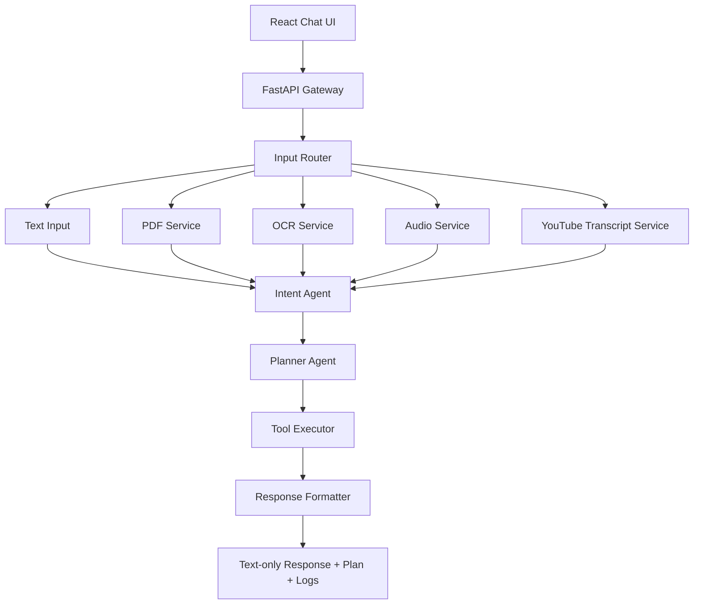

# Architecture

## Runtime Flow

1. The frontend sends text and an optional file to `/chat`.
2. The backend saves the upload, detects the input type, and extracts content.
3. The intent agent classifies the task and asks a follow-up question when the goal is unclear.
4. The planner records the workflow steps.
5. The executor runs the matching tool and returns a text-only result with logs.

